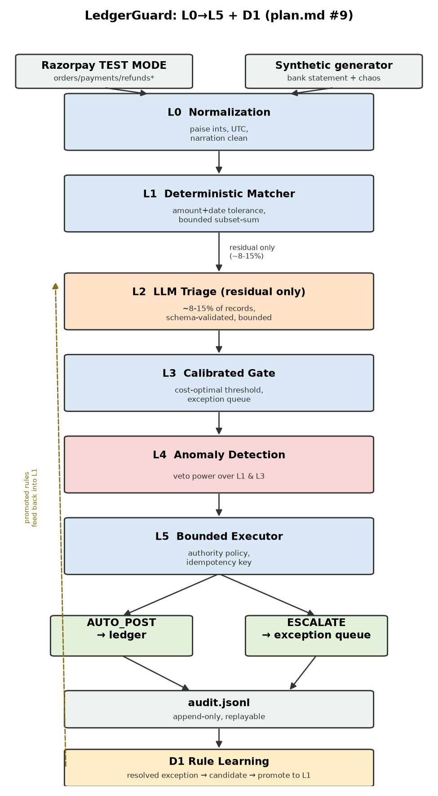

# LedgerGuard

**An AI Finance Controller that reconciles Razorpay orders/payments/refunds against a bank
statement and an internal ledger — and knows when not to act.**

Reconciliation is where merchant money actually goes missing. A bank credit that looks like a
clean match can be a genuine payment, a reporting duplicate, or a real double-settlement — and
automating the wrong guess either loses money or double-counts it. LedgerGuard's answer: a
deterministic-first pipeline that only ever reaches for an LLM on the residual it genuinely can't
resolve, calibrates that residual's confidence against real cost, and refuses to act at all the
moment a second, independent signal (an anomaly detector) disagrees.

> *"It's the one that refused to post the double-settlement."* — see [the twin case](#the-twin-case) below.

## Architecture



Six deterministic layers (L0 normalize → L1 rules → L3 calibrate+gate → L4 anomaly veto → L5
bounded executor) around exactly **one** LLM call site (L2, residual-only), plus a feedback loop
(D1) that compiles human corrections into new deterministic rules over time. Full writeup:
[`docs/architecture.md`](docs/architecture.md); the single-LLM-call-site decision itself is
recorded as [`docs/adr/001-single-ai-component.md`](docs/adr/001-single-ai-component.md).

## One-command repro

```bash
make setup          # pip install -e ".[dev]"
make test           # 129+ tests, no network, no API key
make close           # run the full pipeline against the committed sample data
make bench           # the pre-registered ablation + operational metrics (below)
make redteam         # adversarial survival rate
make d1              # D1 rule-learning invocation-decay demonstration
python -m eval.report  # renders report.md + report.html from the make bench run above
```

Every command above runs against the **committed** `data/samples/` (300 seeded bank lines, all
10 chaos categories, the duplicate-UTR/genuine-double-settlement demo pair forced into holdout)
and needs **no API key, no network access, and no Razorpay credentials** — the L2 call site
degrades to a committed, content-hashed free fallback whenever no LLM credential is present, and
that is the default `make bench`/`make close`/`make demo` run on any machine. A real model *can*
be swapped in (`l2_llm_triage/factory.py` auto-detects an Anthropic, OpenAI, or Gemini key from
the environment) — see [Limitations](#limitations) for what that run actually measured.

## The twin case

The demo pair `data/samples/chaos_manifest.json` forces into holdout: two bank credits, same
amount (₹48,200), same date, near-identical narration. One is a reporting artifact (the same UTR
posted twice — money sent once, reported twice). The other is a genuine double-settlement (two
different UTRs, the merchant really was paid twice for the same order batch). `make close` posts
**neither** — both get distinct reason codes (`DUPLICATE_UTR` / `GENUINE_DOUBLE_SETTLEMENT`) via
L4's veto, confirmed directly against the database, not just a passing unit test
(`tests/test_anomaly_veto.py`, `BROKE.md` Phase 6).

## Stratified results (pre-registered ablation)

**The decision rule below was committed to git in [`PREREGISTRATION.md`](PREREGISTRATION.md)
*before* this table was ever computed** — verify with `git log --follow PREREGISTRATION.md`.

Ablation run: `data/samples/`, holdout split, `make bench` (see [`report.md`](report.md) for the
exact committed output this table is transcribed from).

| Stratum | n | Rules-only F1 | Hybrid F1 | Δ | LLM-only F1 | LLM calls | ₹/1,000 |
|---|---|---|---|---|---|---|---|
| EASY | 49 | 1.000 | 1.000 | 0.000 | 0.000 | 0 | 0.00 |
| MEDIUM | 2 | 1.000 | 1.000 | 0.000 | 0.000 | 0 | 0.00 |
| HARD | 4 | 0.000 | 0.000 | 0.000 | 0.000 | 4 | 2384.49 |
| ADVERSARIAL | 5 | 0.667 | 0.667 | 0.000 | 0.000 | 0 | 0.00 |
| **Overall** | 60 | **0.964** | **0.964** | **0.000** | 0.000 | 4 | 158.97 |

**Δ (HARD+ADVERSARIAL, combined) = 0.000.**

### The verdict, in the language `PREREGISTRATION.md` permits for this outcome band

> **Δ < 0.03: the LLM is not justified on this holdout.** Rules-only and hybrid are numerically
> identical on every stratum measured. This is reported as a **negative result**: the
> deterministic layer (L1) does essentially all of the correctness work in this dataset, and the
> free fallback L2 has been running in every session neither helps nor hurts it here. Per
> `plan.md` §24.2, this is the *strongest* possible answer to Razorpay's own "where you chose NOT
> to use AI" criterion, not a shortfall — the pre-registered rule commits to reporting it plainly
> rather than reframing it as a win.

**EASY-stratum Δ = 0.000** — matches the pre-registered prediction (Δ≈0 expected) exactly. No
L1 gap to file in `BROKE.md` for this criterion.

**LLM-only scored 0.000 F1 on every stratum**, including EASY. This is not a claim about what a
*real* Claude model would do — no environment this project has run in has had live credentials to
test that. It is a precise, structural property of the **free rapidfuzz fallback** that has served
every L2 call so far: `fallback_triage` only ever answers when handed exactly one candidate
payment, and the bounded candidate window (`PaymentIndex.candidates_before`, unchanged from L1's
own) typically contains 15-30 payments in this dataset — so without L1's amount-matching to narrow
the field first, the fallback almost never has grounds to answer at all. Reported in full, per
`PREREGISTRATION.md`'s rule that "LLM-only is reported regardless of outcome, even if it wins" —
here it is the opposite extreme, and that is reported too.

**A caveat on statistical weight**, stated plainly rather than glossed over: `data/samples`'s
HARD (n=4) and ADVERSARIAL (n=5) holdout strata are small — 9 records combined. The Δ=0.000
result is exact on this committed dataset, but a single flipped record would move it several
points. This is an honest property of the 300-line committed sample, not something tuned around;
see [Limitations](#limitations).

### Operational metrics (the full shipped pipeline, per stratum)

| Stratum | n | Auto-match % | Precision (auto-posted) | Recall | F1 | False auto-match % | Exception-queue precision |
|---|---|---|---|---|---|---|---|
| EASY | 49 | 85.7% | 100.0% | 100.0% | 1.00 | 0.0% | 0.0% |
| MEDIUM | 2 | 0.0% | 0.0% | 100.0% | 1.00 | 0.0% | 0.0% |
| HARD | 4 | 0.0% | 0.0% | 0.0% | 0.00 | 0.0% | 25.0% |
| ADVERSARIAL | 5 | 60.0% | 60.0% | 75.0% | 0.67 | 0.0% | 0.0% |
| **Overall** | 60 | 75.0% | **96.4%** | 96.4% | 0.96 | **0.0%** | 9.1% |

Zero false auto-matches on this holdout run: nothing the system auto-posted was wrong. L3's
calibrated threshold (0.98, selected on validation only) is conservative by design — the cost
model penalizes a wrong auto-post by its full rupee value, so it would rather escalate than guess.
ECE (expected calibration error) on holdout: **0.102 raw → 0.071 calibrated**
(`eval/calibration.py`).

## D1 — the LLM's workload shrinks over time

A human resolves one escalated bank line; the system generalizes it into a candidate rule
(narration scope + widened settlement-date tolerance), validates it against train+validation
history, and promotes it into L1 only if it hits ≥3 times with zero false positives. Measured
across 3 sequential batches (on a dataset generated specifically to have enough volume of the one
genuinely-learnable pattern in this design — see `PROGRESS.md` Phase 8 for why `data/samples`
itself doesn't have enough):

| Batch | LLM invocation rate | Precision (auto-posted) | Cost / 1,000 |
|---|---|---|---|
| 1 | 17.1% | 88.6% | $4.91 |
| 2 | 15.0% | 97.8% | $4.31 |
| 3 | 11.2% | 97.8% | $3.23 |

Invocation rate falls, precision holds (in fact improves), cost falls in step. Chart:
`eval/output/invocation_decay.png` (regenerate via `make d1`).

## D2 — an adversarial red team

`data/redteam.py` attacks the shipped pipeline with 60 cases across 4 categories. Measured
survival rate: **48/60 (80.0%)**, kept fully separate from the holdout split above so it never
contaminates the ablation numbers.

| Category | Survival |
|---|---|
| PLAUSIBLE_WRONG_SUBSET_SUM | 15/15 (100%) — found and fixed a real subset-sum ambiguity bug; see `BROKE.md` Phase 7 |
| PROMPT_INJECTION_NARRATION | 15/15 (100%) — provably abstains: two structurally tied candidates, no signal can break the tie |
| REFUND_TIMED_TO_LOOK_PERFECT | 15/15 (100%) |
| NEAR_COLLISION_PAIR | 3/15 (20%) — an honestly unfixed, structural gap; see below |

## Limitations

Stated plainly, per `plan.md` §25 and the absence of a `CLAUDE.md` in this repo (flagged in
`PROGRESS.md` since Phase 0 — no such file was ever supplied to reconcile chaos-category
assumptions against):

- **Every data source in this repo is synthetic or simulated, not real.** Orders/payments/refunds
  are generator-invented (no live Razorpay credentials or network egress have been available in
  any session — `REAL_VS_SIMULATED.md` has the full, row-by-row account). Settlements are
  synthesized by design, per this project's own Phase 0 research finding that Razorpay test mode
  does not produce real settlement batches.
- **Bounded subset-sum is a real, admitted limit, not just a performance safeguard.** It is
  capped by `MAX_GROUP_SIZE=12` and `MAX_SEARCH_NODES=20,000`; exceeding either escalates rather
  than hangs, by design. Separately (found in Phase 8, not fixed — Phase 2/3-era, out of later
  phases' scope): `SPLIT_SETTLEMENT`'s generator draws group members' capture times independently
  with no time clustering, so some members legitimately fall outside the date-tolerance window a
  subset-sum search filters against — every `SPLIT_SETTLEMENT` bank line in `data/samples`
  currently escalates rather than resolves, for exactly this reason. See `BROKE.md` Phase 8.
- **The calibrator's distribution is small and synthetic.** It is fit on this project's own
  300-line sample's 60-record validation split; the HARD/ADVERSARIAL strata it's evaluated against
  in the ablation above are 4 and 5 records respectively (see the statistical-weight caveat
  above). A larger, real-traffic validation set would materially change confidence in the exact
  threshold (0.98) chosen.
- **Red-team construction is this project's own**, not an independently sourced attack corpus.
  The measured 80% survival rate describes robustness to *this suite specifically*, and one
  category (`NEAR_COLLISION_PAIR`, 20% survival) is an honestly reported, structural gap: amount +
  date + narration matching with no independent per-order reference field cannot, even in
  principle, distinguish a genuine settlement from a same-amount coincidence. Closing it would
  need a signal this data model doesn't have (e.g., an order reference embedded in the real bank
  narration — unconfirmed for real Razorpay settlement narrations; see
  `docs/razorpay-verification.md`).
- **L2 defaults to the free fallback; the ablation's headline numbers above are from a live
  model.** Earlier phases of this project ran with no LLM credential and, separately, believed
  network egress to `api.anthropic.com` was unavailable — it wasn't; only the credential was
  missing (`REAL_VS_SIMULATED.md` row 15 has the corrected account). Once a credential and the
  `triage_fn` injection seam (`decisions.py`, `benchmark/ablation.py`) existed, the pre-registered
  ablation was re-run against a live model (see `REAL_VS_SIMULATED.md` for exactly which provider
  and the resulting Δ). `make close`/`make demo`/`make bench` still default to the free fallback —
  a public demo shouldn't spend real money or vary run to run on every visitor.
- **Cost and latency figures are estimates, not measured spend.** `eval/metrics.py` and
  `eval/rule_learning.py` reuse `client.py`'s real Anthropic pricing table, substituting a
  documented chars/4 token-count approximation for the one missing piece (a live tokenizer). The
  USD→INR conversion (`eval/metrics.py: USD_TO_INR = 83.0`) is a fixed, point-in-time
  approximation, not a live FX rate. p50 latency reports the fallback path's local compute time,
  not a real API round trip.

## Live UI

`frontend/` is a small React control center over the same pipeline `make close`/`make bench`
run — a reconciliation queue, a per-decision investigation view (match signals, the authority
policy, a gated execute button), and an evaluation page with the ablation and D1/D2 results. It
talks to `src/ledgerguard/api/` (FastAPI), deployed separately from the UI because the project's
dependency set doesn't fit in a serverless size limit — see `DEPLOYMENT.md` for the split, the
cold-start handling, and everything that was actually verified before shipping it (not just
"the build didn't error").

Local dev: `make api` in one shell, `make ui` in another.

## Repository map

`PROGRESS.md` and `BROKE.md` carry the full, phase-by-phase account of what was built, what broke,
and how — including every honest gap listed above, with more detail than fits here.
